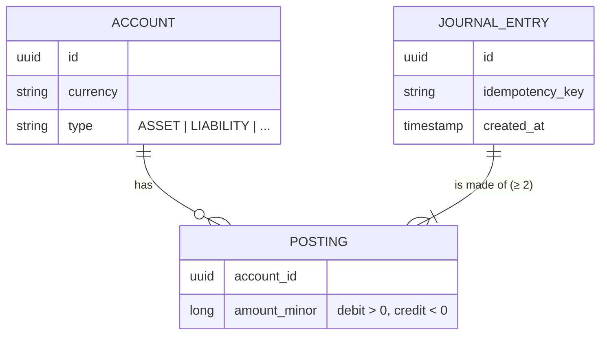

# ledger-core

[](https://github.com/armando-calz/ledger-core/actions/workflows/ci.yml)

A double-entry ledger service for moving money between accounts — correctly, idempotently and safely under concurrency.

> **Status:** 🚧 early development. The roadmap below tracks what is done and what is next.

## Why

Every fintech product — wallets, cards, transfers, exchanges — sits on top of a ledger. A ledger that loses a cent, double-applies a retried request or races two concurrent withdrawals is a production incident. This project is a focused exploration of the techniques that prevent those failures:

- **Double-entry bookkeeping** — every movement is a balanced journal entry; money is never created or destroyed.
- **Integer minor units** — amounts are stored as `long` cents (or the currency's minor unit), never floating point.
- **Idempotency keys** — a retried request returns the original result instead of moving money twice.
- **Concurrency control** — balances stay consistent when many transfers hit the same account at once.
- **Immutability** — entries are append-only; corrections are new, reversing entries.

## Core model



**Invariant:** for every journal entry, the postings in each currency sum to zero.

Positive amounts are **debits**, negative amounts are **credits**. Customer wallets are *liability* accounts — the money in them is owed to the customer — so a wallet balance increases with credits (see [ADR 0002](docs/adr/0002-account-types-and-sign-convention.md)).

Alice pays Bob `$100.00 MXN` from her wallet: one journal entry, two postings.

| Account | Type | Posting (minor units) | Balance seen by the customer |
|---|---|---|---|
| Alice wallet | Liability | `+10000` (debit) | decreases by 100.00 |
| Bob wallet | Liability | `-10000` (credit) | increases by 100.00 |
| **Sum** | | **`0`** | |

## Tech stack

Java 21 · Spring Boot 4 · Maven · PostgreSQL · Flyway · Testcontainers · Docker · GitHub Actions

## Roadmap

- [x] Project bootstrap
- [x] `Money` value object and currency handling
- [x] Journal entries and postings with the per-currency zero-sum invariant
- [x] Account model: types, currency, status
- [ ] PostgreSQL persistence with Flyway migrations
- [ ] REST API: create accounts, post transfers, query balances and history (OpenAPI docs)
- [ ] Idempotency keys for transfer requests
- [ ] Concurrency control with tests that race parallel transfers
- [ ] Reversals (corrections as new entries)
- [ ] Docker Compose setup for local run

Design decisions are recorded as ADRs in [`docs/adr`](docs/adr).

## Running locally

Requirements: JDK 21 (a [`.sdkmanrc`](.sdkmanrc) is included for [SDKMAN!](https://sdkman.io) users).

```bash
./mvnw verify          # build and run the tests
./mvnw spring-boot:run # start the service on :8080
curl localhost:8080/actuator/health
```

## License

[MIT](LICENSE)
