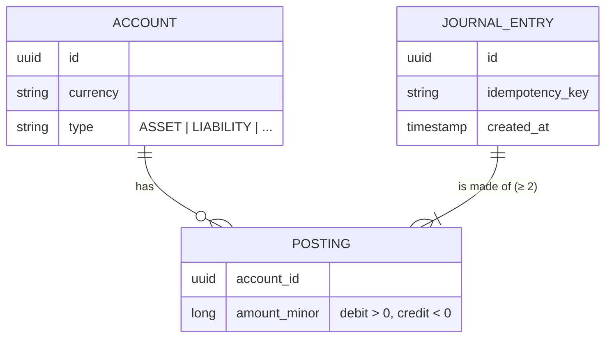

# ledger-core

[](https://github.com/armando-calz/ledger-core/actions/workflows/ci.yml)

A double-entry ledger service for moving money between accounts — correctly, idempotently and safely under concurrency.

> **Status:** 🚧 early development. The roadmap below tracks what is done and what is next.

## Why

Every fintech product — wallets, cards, transfers, exchanges — sits on top of a ledger. A ledger that loses a cent, double-applies a retried request or races two concurrent withdrawals is a production incident. This project is a focused exploration of the techniques that prevent those failures:

- **Double-entry bookkeeping** — every movement is a balanced journal entry; money is never created or destroyed.
- **Integer minor units** — amounts are stored as `long` cents (or the currency's minor unit), never floating point.
- **Idempotency keys** — a retried request returns the original result instead of moving money twice.
- **Concurrency control** — balances stay consistent when many transfers hit the same account at once.
- **Immutability** — entries are append-only; corrections are new, reversing entries.

## Core model



**Invariant:** for every journal entry, the postings in each currency sum to zero.

Positive amounts are **debits**, negative amounts are **credits**. Customer wallets are *liability* accounts — the money in them is owed to the customer — so a wallet balance increases with credits (see [ADR 0002](docs/adr/0002-account-types-and-sign-convention.md)).

Alice pays Bob `$100.00 MXN` from her wallet: one journal entry, two postings.

| Account | Type | Posting (minor units) | Balance seen by the customer |
|---|---|---|---|
| Alice wallet | Liability | `+10000` (debit) | decreases by 100.00 |
| Bob wallet | Liability | `-10000` (credit) | increases by 100.00 |
| **Sum** | | **`0`** | |

## Tech stack

Java 21 · Spring Boot 4 · Maven · PostgreSQL · Flyway · Testcontainers · Docker · GitHub Actions

## Roadmap

- [x] Project bootstrap
- [x] `Money` value object and currency handling
- [x] Journal entries and postings with the per-currency zero-sum invariant
- [x] Account model: types, currency, status
- [x] PostgreSQL persistence with Flyway migrations, with the invariants also enforced by the database
- [x] REST API: open accounts, post transfers, query balances and movements (OpenAPI docs, RFC 9457 errors)
- [ ] Idempotency keys for transfer requests
- [ ] Overdraft protection (insufficient funds), checked under row locks
- [ ] Concurrency control with tests that race parallel transfers
- [ ] Reversals (corrections as new entries)
- [ ] Docker Compose setup for local run

Design decisions are recorded as ADRs in [`docs/adr`](docs/adr).

## API

Interactive docs at `http://localhost:8080/swagger-ui.html` once the service is running. Amounts are **decimal strings** (`"100.50"`), never floating-point numbers. Errors use [RFC 9457](https://www.rfc-editor.org/rfc/rfc9457) problem details: `400` for malformed requests, `404` for unknown accounts, and `422` for requests that would break a ledger rule.

| Method | Path | Description |
|---|---|---|
| `POST` | `/api/v1/accounts` | Open an account |
| `GET` | `/api/v1/accounts/{id}` | Get an account |
| `GET` | `/api/v1/accounts/{id}/balance` | Balance from the holder's point of view |
| `GET` | `/api/v1/accounts/{id}/movements` | Most recent movements, newest first |
| `POST` | `/api/v1/transfers` | Debit one account and credit another |

```bash
# Alice (a customer wallet) pays Bob 100.00 MXN
curl -s localhost:8080/api/v1/transfers -H 'Content-Type: application/json' -d '{
  "debitAccountId": "<alice-wallet-id>",
  "creditAccountId": "<bob-wallet-id>",
  "amount": "100.00", "currency": "MXN", "description": "Dinner"
}'
```

```json
{
  "id": "6e5a5ea5-374c-4340-8a36-959c28d225a0",
  "description": "Dinner",
  "postings": [
    { "accountId": "3a30a91d-…", "amount": "100.00",  "currency": "MXN" },
    { "accountId": "c74bb973-…", "amount": "-100.00", "currency": "MXN" }
  ]
}
```

A transfer in the wrong currency is rejected without moving any money:

```json
{ "status": 422, "title": "Ledger rule violated", "detail": "Currency mismatch: expected MXN but got USD" }
```

## Running locally

Requirements: JDK 21 (a [`.sdkmanrc`](.sdkmanrc) is included for [SDKMAN!](https://sdkman.io) users) and Docker.

```bash
./mvnw verify              # unit tests + integration tests against a PostgreSQL container
./mvnw spring-boot:test-run # start the service on :8080 with a throwaway PostgreSQL
curl localhost:8080/actuator/health
```

<details>
<summary>Using Colima instead of Docker Desktop</summary>

```bash
export DOCKER_HOST="unix://$HOME/.colima/default/docker.sock"
export TESTCONTAINERS_DOCKER_SOCKET_OVERRIDE=/var/run/docker.sock
```
</details>

## License

[MIT](LICENSE)
